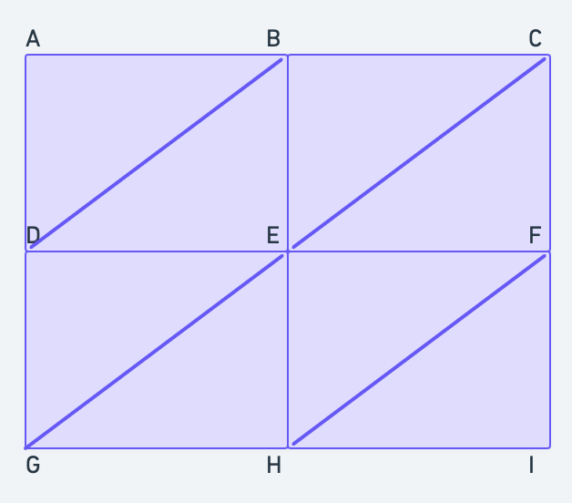
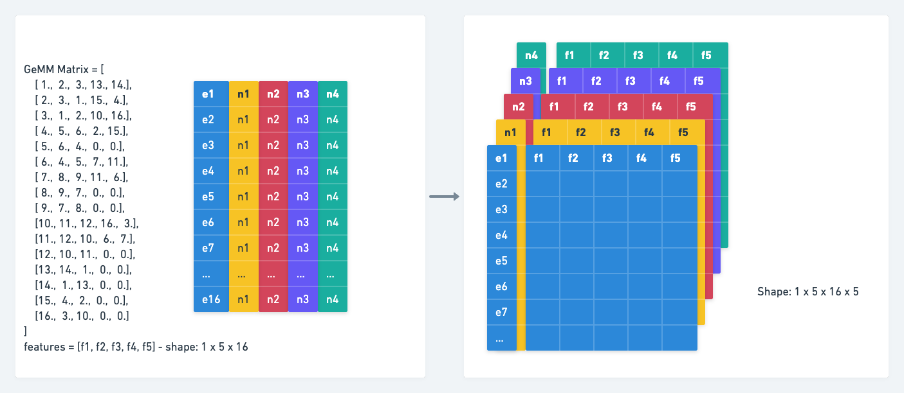

# Mesh CNN tutorial

Contents

1. [Introduction to Mesh Convolution](#1-introduction-to-mesh-convolution)

   1.1 [How do we prepare the mesh to input into the network?](#11-how-do-we-prepare-the-mesh-to-input-into-the-network)

   1.2 [How to apply apply mesh convolution on this data?](#12-how-to-apply-apply-mesh-convolution-on-this-data)
   

2. [Introduction to Mesh Pooling]()
    
    2.1 [What edges are eligible for pooling in our mesh?](#21-what-edges-are-eligible-for-pooling-in-our-mesh)

    2.2 [How to prioritize the order of collapse among the eligible edges?](#22-how-to-prioritize-the-order-of-collapse-among-the-eligible-edges)

-----

## 1. Introduction to Mesh Convolution

### 1.1 How do we prepare the mesh to input into the network?

Suppose you have a function called ``create_mesh(filepath: str)``. This function accepts a ``filepath`` which is the path to your obj file. 

This function needs to do atleast the following tasks - 

    (a). Read mesh from file

    (b). Remove non-manifold edges (we will define it later for you)

    (c). Preprocessing the mesh

    (d). Building Convolution friendly matrix from mesh. We will call this GeMM matrix.

    (e). Post processing the mesh

    (f). Feature creation.


We will look at ``(b)``, ``(d)`` and ``(f)`` in detail to understand the fundamental parts of data preparation for convolution.

**(a) Read mesh from file**

Returns faces and vertices, where each face is a triangle

**(b) Remove non-manifold edges**

The function computes face normals and face areas.
If the area of a face is 0 or if the face is disconnected (none of the edge of that face is shared by any other face). Then the face is classified as non-manifold. example - polygon soup.

**(c) Preprocessing the mesh**

If preprocessing is enabled then we can flip some percentage of the edges of the graph.

**(d) Building Convolution friendly matrix from mesh (GeMM matrix)**

A GeMM matrix is a matrix that is the result of an operation called ``im2col``. Think of this as flattening your ``N8`` neighborhood into a 1 dimension array. If we have 5 such ``N8`` neighborhoods around the entire image then our resulting GeMM matrix will be of the form [c1, c2, c3, c4, c5]. Where each $c_i$ is a 1-d vector containing all the neighborhood nodes. If we have more than 1 channel then the ``N8`` neighborhoods will be present in the same way as for the first channel. We append the $c_i$ values of these channel 1-K after $c_i$ values of channel 0.

Before ``im2col`` operation


After ``im2col`` operation


**(e) Post processing the mesh**

If this feature is enabled then we can slide some percentage of the nodes in random directions.

**(f) Feature Creation**

For each edge we will create a 5 tuple list of features
- dihedral angle
- 2 symmetric inner angles
- 2 ratio of corresponding edge length / perpendicular `` [e1/p1, e2/p2]`` for the triangles sharing that edge


Let us look at an actual example to find out how to calculate these values -

Consider the following planar mesh



This planar mesh has a 9 nodes, 16 edges and 8 faces. Let us label each of these nodes.

| A | B | C|
| --|--|--|
| **D** | **E** | **F**|
| **G** | **H** | **I**|

Lets assign these nodes some coordinates - 

```
A = [-1, 0, 1]
B = [0, 0, 1]
C = [1, 0, 1]
D = [-1, 0, 0]
E  = [0, 0, 0]
F = [1, 0, 0]
G = [-1, 0, -1]
H = [0, 0, -1]
I = [1, 0, -1]
```
After we read the mesh from our file, these nodes are read in the following order

```
nodes = [A, C, G, I, D, B, F, H, E]
```
Our edges are created as follows -
```python
edges = {   
            (0, 4): 7,
            (0, 5): 8,
            (1, 5): 11,
            (1, 6): 15,
            (1, 8): 9,
            (2, 4): 4,
            (2, 7): 14,
            (2, 8): 3,
            (3, 6): 12,
            (3, 7): 13,
            (4, 5): 6,
            (4, 8): 5,
            (5, 8): 10,
            (6, 7): 0,
            (6, 8): 2,
            (7, 8): 1 
        }
#edges = ['FH', 'HE', 'FE', 'GE', 'GD', 'DE', 'DB', 'AD', 'AB', 'CE', 'BE', 'CB', 'IF', 'IH', 'GH', 'CF']
 ```
 | A | B | C|
| --|--|--|
| **D** | **E** | **F**|
| **G** | **H** | **I**|

eg - ``(A, D) <=> (0, 4)`` as index of A and D is 0, 4 in the `nodes` list respectively

We will start with a simple example and then move on to a harder example.

+ Case 1 - Edge features for edge ``BD`` (simple example)
  
  For the edge [B, D] it is visually intuitive to find the neighboring points as [A, E] and then calculate all these 5 features. The neigobors we get out of the code is ``[0, 8]`` which is [A, E]. They send this 4 point list  [B, D, A, E] to compute the edge features.
  
+ Case 2 - Edge features for edge ``AD`` (hard example)
  
  For the edge [A, D] it is not clear on how to do the same thing. Our code returns us [5, 5] which is [B, B]. Each edge can have atmost 2 faces it can be part of. Therefore it can have atmost 4, 1-ring neighboring edges.
  The ``GeMM matrix`` keeps track of these neighbors. The entries for its neighboring edges are ``[ 8,  6, -1, -1]`` which says it has 2 edges connected to it directly. those are [A, B] and [D, B]. Since its not being shared by another triangle we have a `-1` entry for other edge entries.
  
Look at this image for illustration


In case 1 common node of b and c, common node of d and e become the side points. In case 2 we copy the values of b and c into 
edge d and e respectively. This is because b and d do not exist
in case 2. You can take a look at the code to confirm this.

```python
def get_side_points(mesh, edge_id):
  
    edge_a = mesh.edges[edge_id]

    if mesh.gemm_edges[edge_id, 0] == -1:
        edge_b = mesh.edges[mesh.gemm_edges[edge_id, 2]]
        edge_c = mesh.edges[mesh.gemm_edges[edge_id, 3]]
    else:
        edge_b = mesh.edges[mesh.gemm_edges[edge_id, 0]]
        edge_c = mesh.edges[mesh.gemm_edges[edge_id, 1]]
    if mesh.gemm_edges[edge_id, 2] == -1:
        edge_d = mesh.edges[mesh.gemm_edges[edge_id, 0]]
        edge_e = mesh.edges[mesh.gemm_edges[edge_id, 1]]
    else:
        edge_d = mesh.edges[mesh.gemm_edges[edge_id, 2]]
        edge_e = mesh.edges[mesh.gemm_edges[edge_id, 3]]
    # edge_a - common edge
    # first triangle
    # edge_b 
    # edge c
    # second triangle
    # edge_d 
    # edge_e 

    '''
    if edge_d, edge_e is not avaible
    then copy values of edge_b, edge_c
    into edge_d, edge_e

    the four vertices will be
    2 vertices of edge a
    1 vertex to complete left triangle
    1 vertex to complete right triangle

    then,

    edge_a = [0, 4]
    edge_b = [0, 5]
    edge_c = [4, 5]
    edge_d = edge_b
    edge_e = edge_c

    first_vertex = 0
    second_vertex = 1
    third_vertex = 1

    return [a1, a2, edge_b[1], edge_d[1]]
    i.e return [0, 4, 5, 5]

    
    '''
    first_vertex = 0
    second_vertex = 0
    third_vertex = 0
    if edge_a[1] in edge_b:
        first_vertex = 1
    if edge_b[1] in edge_c:
        second_vertex = 1
    if edge_d[1] in edge_e:
        third_vertex = 1
    return [edge_a[first_vertex], edge_a[1 - first_vertex], edge_b[second_vertex], edge_d[third_vertex]]


```

### 1.2 How to apply apply mesh convolution on this data?

Currently, we have created features for each edge and hold information about the 1 ring neighbors using the GeMM matrix. We are now ready to perform convolution on this data. Inside the mesh convolution module there are 3 major steps.

    (a) Pad GeMM matrix
    (b) Create actual GeMM matrix (In reality we cannot convolve over indices but over features, this step combines index based GeMM with our features)
    (c) Create symmetric features
    (d) Convolution

**(a) Pad GeMM matrix**
In this step, we pad the GeMM matrix with -
- Extra rows - to make sure all meshes in input have same number of edges
- Add extra column which contains row index.

Visually given an input matrix -
```python
GeMM = [[ 1,  2, 12, 13],
       [ 2,  0, 14,  3],
       [ 0,  1,  9, 15],
       [ 4,  5,  1, 14],
       [ 5,  3, -1, -1],
       [ 3,  4,  6, 10],
       [ 7,  8, 10,  5],
       [ 8,  6, -1, -1],
       [ 6,  7, -1, -1],
       [10, 11, 15,  2],
       [11,  9,  5,  6],
       [ 9, 10, -1, -1],
       [13,  0, -1, -1],
       [ 0, 12, -1, -1],
       [ 3,  1, -1, -1],
       [ 2,  9, -1, -1]]

# It gets transformed to - 
padded_GeMM = 
        [[ 0.,  1.,  2., 12., 13.],
         [ 1.,  2.,  0., 14.,  3.],
         [ 2.,  0.,  1.,  9., 15.],
         [ 3.,  4.,  5.,  1., 14.],
         [ 4.,  5.,  3., -1., -1.],
         [ 5.,  3.,  4.,  6., 10.],
         [ 6.,  7.,  8., 10.,  5.],
         [ 7.,  8.,  6., -1., -1.],
         [ 8.,  6.,  7., -1., -1.],
         [ 9., 10., 11., 15.,  2.],
         [10., 11.,  9.,  5.,  6.],
         [11.,  9., 10., -1., -1.],
         [12., 13.,  0., -1., -1.],
         [13.,  0., 12., -1., -1.],
         [14.,  3.,  1., -1., -1.],
         [15.,  2.,  9., -1., -1.]]
```
Code
```python
def pad_gemm(self, m, xsz, device):
        """ extracts one-ring neighbors (4x) -> m.gemm_edges
        which is of size #edges x 4
        add the edge_id itself to make #edges x 5
        then pad to desired size e.g., xsz x 5
        """
        padded_gemm = torch.tensor(m.gemm_edges, device=device).float()
        padded_gemm = padded_gemm.requires_grad_()
        padded_gemm = torch.cat((torch.arange(m.edges_count, device=device).float().unsqueeze(1), padded_gemm), dim=1)
        # [[1.,  2., 12., 13.],  [2.,  0., 14.,  3.]]->  [[ 0.,  1.,  2., 12., 13.],[ 1.,  2.,  0., 14.,  3.]]
        # xsz is the number of edges you want to pad each mesh to, in our example its 16
        # pad using F
        padded_gemm = F.pad(padded_gemm, (0, 0, 0, xsz - m.edges_count), "constant", 0)
        padded_gemm = padded_gemm.unsqueeze(0)
        return padded_gemm # torch.Size([16, 5])
```

Now we are ready with the following -


This GeMM matrix contains edge_ids. We need to replace these edge ids with the corresponding edge features.

**(b) Create actual GeMM matrix**


```python

## Inputs
features = [[[9.3738, 9.3738, 9.3738, 9.3738, 2.1082, 9.3738, 9.3738, 2.1082,
          2.1082, 9.3738, 9.3738, 2.1082, 2.1082, 2.1082, 2.1082, 2.1082],
         [9.5310, 5.5651, 5.5651, 9.5310, 5.5651, 5.5651, 9.5310, 5.5651,
          5.5651, 9.5310, 5.5651, 5.5651, 5.5651, 5.5651, 5.5651, 5.5651],
         [9.5310, 5.5651, 5.5651, 9.5310, 5.5651, 5.5651, 9.5310, 5.5651,
          5.5651, 9.5310, 5.5651, 5.5651, 5.5651, 5.5651, 5.5651, 5.5651],
         [3.6986, 7.5237, 7.5553, 3.6986, 7.5237, 7.5553, 3.6986, 7.5237,
          7.5237, 3.6986, 7.5237, 7.5237, 7.5237, 7.5237, 7.5237, 7.5237],
         [3.6889, 7.5043, 7.5358, 3.6889, 7.5358, 7.5358, 3.6889, 7.5358,
          7.5358, 3.6889, 7.5043, 7.5358, 7.5358, 7.5358, 7.5358, 7.5358]]]
# features shape - [1, 5, 16]
padded_GeMM = 
        [[ 0.,  1.,  2., 12., 13.],
         [ 1.,  2.,  0., 14.,  3.],
         [ 2.,  0.,  1.,  9., 15.],
         [ 3.,  4.,  5.,  1., 14.],
         [ 4.,  5.,  3., -1., -1.],
         [ 5.,  3.,  4.,  6., 10.],
         [ 6.,  7.,  8., 10.,  5.],
         [ 7.,  8.,  6., -1., -1.],
         [ 8.,  6.,  7., -1., -1.],
         [ 9., 10., 11., 15.,  2.],
         [10., 11.,  9.,  5.,  6.],
         [11.,  9., 10., -1., -1.],
         [12., 13.,  0., -1., -1.],
         [13.,  0., 12., -1., -1.],
         [14.,  3.,  1., -1., -1.],
         [15.,  2.,  9., -1., -1.]]
# padded_GeMM shape - [1, 16, 5]

# 1. add 0 along each row of feature vector
[
    [0.0000, 9.3738, 9.3738, 9.3738, 9.3738, 2.1082, 9.3738, 9.3738,
          2.1082, 2.1082, 9.3738, 9.3738, 2.1082, 2.1082, 2.1082, 2.1082,
          2.1082],
         [0.0000, 9.5310, 5.5651, 5.5651, 9.5310, 5.5651, 5.5651, 9.5310,
          5.5651, 5.5651, 9.5310, 5.5651, 5.5651, 5.5651, 5.5651, 5.5651,
          5.5651] ...
]
#features shape - torch.Size([1, 5, 17])

# 2. shift GeMM matrix by 1 index
[
    [ 1.,  2.,  3., 13., 14.],
    [ 2.,  3.,  1., 15.,  4.],
    [ 3.,  1.,  2., 10., 16.],
    [ 4.,  5.,  6.,  2., 15.],
    [ 5.,  6.,  4.,  0.,  0.],
    [ 6.,  4.,  5.,  7., 11.],
    [ 7.,  8.,  9., 11.,  6.],
    [ 8.,  9.,  7.,  0.,  0.],
    [ 9.,  7.,  8.,  0.,  0.],
    [10., 11., 12., 16.,  3.],
    [11., 12., 10.,  6.,  7.],
    [12., 10., 11.,  0.,  0.],
    [13., 14.,  1.,  0.,  0.],
    [14.,  1., 13.,  0.,  0.],
    [15.,  4.,  2.,  0.,  0.],
    [16.,  3., 10.,  0.,  0.]
]
# 3. Flatten GeMM ids
'''
    This function ensures that edge ids are unique across batches
    when we load 2 meshes they can have same edge ids
    when doing batch processing we need to ensure that edge ids
    are unique across batch hence we add extra index across batch.

    Lets look at an example to see how that happens - 

    Input: GeMM matrix -
    Output: GeMM matrix with unique edge ids across batches


    Example:
    given a GeMM matrix with size [batches, 16, 5]
    Create a matrix of dimensions [batches, 16+1, 1]
    Each batch will have an element = batch_number * (16+1)
    
    if batches = 1 - 
    add_fac = [[[0], [0], ..., [0]]
                    ]
                    1 x 17
    if batches = 2
    add_fac =  [[[0], [0], ..., [0]]
                ],
            [[17], [17], ..., [17]]
                ]
                2 x 17
    Repeat these elements across final dimension -
    if batches = 1 - 
    add_fac = [[[0, 0, 0, 0, 0], [0,...], ..., [0,...]]
                    ]
                    1 x 17 x 5
    if batches = 2
    add_fac =  [[[0, 0, 0, 0, 0], [0,...], ..., [0,...]]
                ],
            [[17, 17, 17, 17, 17], [17,...], ..., [17,...]]
                ]
                2 x 17 x 5

    Finally add the add_fac matrix to your GeMM matrix

In our example our GeMM matrix will not change since we
are having one batch so add_fac matrix will be all 0s.
'''
# 4. Given shifted GeMM matrix and edge features select edge features based on edge ids present inside GeMM matrix.

# features = [1, 5, 17]
# GeMM_flat -> [80,]
GeMM_flat = [ 1,  2,  3, 13, 14,  2,  3,  1, 15,  4,  3,  1,  2, 10, 16,  4,  5,  6,
         2, 15,  5,  6,  4,  0,  0,  6,  4,  5,  7, 11,  7,  8,  9, 11,  6,  8,
         9,  7,  0,  0,  9,  7,  8,  0,  0, 10, 11, 12, 16,  3, 11, 12, 10,  6,
         7, 12, 10, 11,  0,  0, 13, 14,  1,  0,  0, 14,  1, 13,  0,  0, 15,  4,
         2,  0,  0, 16,  3, 10,  0,  0]

final_GeMM = torch.index_select(features, dim=0, index=GeMM_flat)
# final_GeMM -> [80, 5]
# each index tells which row to select
# edge_id 1 means it will select all features of row1
# of features matrix

final_GeMM = [[9.3738, 9.5310, 9.5310, 3.6986, 3.6889],
        [9.3738, 5.5651, 5.5651, 7.5237, 7.5043],
        [9.3738, 5.5651, 5.5651, 7.5553, 7.5358],
        [2.1082, 5.5651, 5.5651, 7.5237, 7.5358],
        [2.1082, 5.5651, 5.5651, 7.5237, 7.5358],
        [9.3738, 5.5651, 5.5651, 7.5237, 7.5043],
        [9.3738, 5.5651, 5.5651, 7.5553, 7.5358],
        [9.3738, 9.5310, 9.5310, 3.6986, 3.6889],
        [2.1082, 5.5651, 5.5651, 7.5237, 7.5358],
        [9.3738, 9.5310, 9.5310, 3.6986, 3.6889],
        [9.3738, 5.5651, 5.5651, 7.5553, 7.5358],
        [9.3738, 9.5310, 9.5310, 3.6986, 3.6889],
        [9.3738, 5.5651, 5.5651, 7.5237, 7.5043],
        [9.3738, 9.5310, 9.5310, 3.6986, 3.6889],
        [2.1082, 5.5651, 5.5651, 7.5237, 7.5358],
        [9.3738, 9.5310, 9.5310, 3.6986, 3.6889],
        [2.1082, 5.5651, 5.5651, 7.5237, 7.5358],
        [9.3738, 5.5651, 5.5651, 7.5553, 7.5358],
        [9.3738, 5.5651, 5.5651, 7.5237, 7.5043],
        [2.1082, 5.5651, 5.5651, 7.5237, 7.5358],
        [2.1082, 5.5651, 5.5651, 7.5237, 7.5358],
        [9.3738, 5.5651, 5.5651, 7.5553, 7.5358],
        [9.3738, 9.5310, 9.5310, 3.6986, 3.6889],
        [0.0000, 0.0000, 0.0000, 0.0000, 0.0000],
        [0.0000, 0.0000, 0.0000, 0.0000, 0.0000],
        [9.3738, 5.5651, 5.5651, 7.5553, 7.5358],
        [9.3738, 9.5310, 9.5310, 3.6986, 3.6889],
        [2.1082, 5.5651, 5.5651, 7.5237, 7.5358],
        [9.3738, 9.5310, 9.5310, 3.6986, 3.6889],
        [9.3738, 5.5651, 5.5651, 7.5237, 7.5043],
        [9.3738, 9.5310, 9.5310, 3.6986, 3.6889],
        [2.1082, 5.5651, 5.5651, 7.5237, 7.5358],
        [2.1082, 5.5651, 5.5651, 7.5237, 7.5358],
        [9.3738, 5.5651, 5.5651, 7.5237, 7.5043],
        [9.3738, 5.5651, 5.5651, 7.5553, 7.5358],
        [2.1082, 5.5651, 5.5651, 7.5237, 7.5358],
        [2.1082, 5.5651, 5.5651, 7.5237, 7.5358],
        [9.3738, 9.5310, 9.5310, 3.6986, 3.6889],
        [0.0000, 0.0000, 0.0000, 0.0000, 0.0000],
        [0.0000, 0.0000, 0.0000, 0.0000, 0.0000],
        [2.1082, 5.5651, 5.5651, 7.5237, 7.5358],
        [9.3738, 9.5310, 9.5310, 3.6986, 3.6889],
        [2.1082, 5.5651, 5.5651, 7.5237, 7.5358],
        [0.0000, 0.0000, 0.0000, 0.0000, 0.0000],
        [0.0000, 0.0000, 0.0000, 0.0000, 0.0000],
        [9.3738, 9.5310, 9.5310, 3.6986, 3.6889],
        [9.3738, 5.5651, 5.5651, 7.5237, 7.5043],
        [2.1082, 5.5651, 5.5651, 7.5237, 7.5358],
        [2.1082, 5.5651, 5.5651, 7.5237, 7.5358],
        [9.3738, 5.5651, 5.5651, 7.5553, 7.5358],
        [9.3738, 5.5651, 5.5651, 7.5237, 7.5043],
        [2.1082, 5.5651, 5.5651, 7.5237, 7.5358],
        [9.3738, 9.5310, 9.5310, 3.6986, 3.6889],
        [9.3738, 5.5651, 5.5651, 7.5553, 7.5358],
        [9.3738, 9.5310, 9.5310, 3.6986, 3.6889],
        [2.1082, 5.5651, 5.5651, 7.5237, 7.5358],
        [9.3738, 9.5310, 9.5310, 3.6986, 3.6889],
        [9.3738, 5.5651, 5.5651, 7.5237, 7.5043],
        [0.0000, 0.0000, 0.0000, 0.0000, 0.0000],
        [0.0000, 0.0000, 0.0000, 0.0000, 0.0000],
        [2.1082, 5.5651, 5.5651, 7.5237, 7.5358],
        [2.1082, 5.5651, 5.5651, 7.5237, 7.5358],
        [9.3738, 9.5310, 9.5310, 3.6986, 3.6889],
        [0.0000, 0.0000, 0.0000, 0.0000, 0.0000],
        [0.0000, 0.0000, 0.0000, 0.0000, 0.0000],
        [2.1082, 5.5651, 5.5651, 7.5237, 7.5358],
        [9.3738, 9.5310, 9.5310, 3.6986, 3.6889],
        [2.1082, 5.5651, 5.5651, 7.5237, 7.5358],
        [0.0000, 0.0000, 0.0000, 0.0000, 0.0000],
        [0.0000, 0.0000, 0.0000, 0.0000, 0.0000],
        [2.1082, 5.5651, 5.5651, 7.5237, 7.5358],
        [9.3738, 9.5310, 9.5310, 3.6986, 3.6889],
        [9.3738, 5.5651, 5.5651, 7.5237, 7.5043],
        [0.0000, 0.0000, 0.0000, 0.0000, 0.0000],
        [0.0000, 0.0000, 0.0000, 0.0000, 0.0000],
        [2.1082, 5.5651, 5.5651, 7.5237, 7.5358],
        [9.3738, 5.5651, 5.5651, 7.5553, 7.5358],
        [9.3738, 9.5310, 9.5310, 3.6986, 3.6889],
        [0.0000, 0.0000, 0.0000, 0.0000, 0.0000],
        [0.0000, 0.0000, 0.0000, 0.0000, 0.0000]]
# reshape this as [1, 16, 5, 5]
# [[e1, e2, e3, e4, e5],  [e1, e2, e3, e4, e5],...]

# each edge has 5 neighbors with features dim as 5
# convert shape to -> [1, 5, 16, 5]
# channel x edge x features
# channel - neighbor number
# so channel 1 has all the
```
So far we have come up to with the following transformation - 



In features matrix on the left f1 corresponds to feature 1 of all the 16 edges.
On the right f1 corresponds to feature 1 of that edge.
Also `n` means `edge neighbor` do not confuse it with node.

Its time to make these edge features symmetric.

**(c) Create Symmetric Features**

```python
# let f be the final GeMM matrix
# apply the symmetric functions for an equivariant conv
x_1 = f[:, :, :, 1] + f[:, :, :, 3] # [1, 5 ,16, 1]
x_2 = f[:, :, :, 2] + f[:, :, :, 4]
x_3 = torch.abs(f[:, :, :, 1] - f[:, :, :, 3])
x_4 = torch.abs(f[:, :, :, 2] - f[:, :, :, 4])
f = torch.stack([f[:, :, :, 0], x_1, x_2, x_3, x_4], dim=3)

```
In the first step they create `x1, x2, x3, x4` symmetric features
and then stack then along with `f1`.


The curly braces `{}` in the image denote the `abs` operation.

Stack!


**(d) Convolution**

Lets called this stacked matrix
G. We are now ready for applying convolution to this matrix.
```python
class MeshConv(nn.Module):
    """ Computes convolution between edges and 4 incident (1-ring) edge neighbors
    in the forward pass takes:
    x: edge features (Batch x Features x Edges)
    mesh: list of mesh data-structure (len(mesh) == Batch)
    and applies convolution
    """
    def __init__(self, in_channels, out_channels, k=5, bias=True):
        super(MeshConv, self).__init__()
        self.conv = nn.Conv2d(in_channels=in_channels, out_channels=out_channels, kernel_size=(1, k), bias=bias)
        self.k = k


    def forward(self, x, mesh):
        # all the GeMM matrix prep steps....
        x = self.conv(G)
```
We are applying a `(1 x k)` convolution filter. So what is k? Here `k = 5`. 


## 2. Introduction to Mesh Pooling

### 2.1 What edges are eligible for pooling in our mesh?

Lets start with an example

After convolution, suppose you have a matrix of size 1 x 8 x 16 x 1 where the 1st index specified the number of channels you added after convolution.

We need to specify what edges are eligible for pooling.


1. Boundary edges given in `yellow` cannot be pooled. Edges like `FH` cannot be pooled. Your 4 neighboring edges should also be non-boundary.

2. If we have some edges that on collapsing result in non-manifold graph, then those edges should not be pooled over.

In this example none of the edges are eligible for pooling. Lets us see an example of which edge is an eligible edge for pooling?


In this example `EG` is an eligible edge as all 4 of its neighbors are non-boundary edges.

Now lets move on to a more complex example.


### 2.2 How to prioritize the order of collapse among the eligible edges?


In this example, suppose we need to collapse only 2 out of the 5 eligible edges colored in red. Which edges should we collase?

Ans: This is prioritized based on their magnitude of their features.

We take the squared L2 norm of these edges and build a priority queue.

Now this is the ideal planar case. Suppose one of the nodes edges was being shared by more than 2 edges. This non-manifold case was not dealt during mesh creation. Lets take an example - 


Each edge of the mesh to which a feature is assigned is shared by exactly two faces, hence implying edge-manifoldness.

In particular cases, collapsing an edge can make the graph non-manifold. 

One of the cases is when there is a 3-valence vertex. (vertex)

Suppose triangles T2 and T3 were having common edge GK instead of 2 different edges GC and GK. How would we deal with that. This is what the authors do -

<!--  -->
 

In this case we have to re-route the edges of the mesh such that none of dash lined `--` sides have GK in their 4 neighbors.

Lets see how this is done  -


For all the edges present in the triangle `FKJ` we first show the 4 edge neighborhood before re-routing and then show the modified neighborhood after re-routing.

The green lines are the 4 edge neighborhood. The purple line is the current middle edge. `x1` and `x2` act as markers of the triangles sharing the purple edge.

This function would return the 3 edges `[GF, GJ, GK]` which would then be removed as a part of the pooling process. 

The final re-routing looks as follows -


<!-- Why did they do that?

Ans: Here are some reasons I can think of -
1. We can see that mesh simplifies and turns more planar in  nature. 
2. Triangle `FKJ` looks like a surface triangle. It maybe the case that `FKJ` gets preference over the triangles `FKG` and `GKJ` present inside.  Therefore, they tried to include the triangle `FKJ` as one of the 2 triangles forming the 4 edge neighborhood for an eligible edge.
 -->
 Why did they do that?

 Collapsing a 3-degree/3-valence node results in a non-manifold edge. We cannot collapse edges adjecent to 3-valence nodes, because it would break the assumption of edge-manifoldness. Refer the diagram below - 
 

 In our diagram we got rid of 3 edges. Now, what other edges are to be removed to safely pool edge FJ (edge_id = 19) keeping the edge-manifoldness property intact?


We can see that if we collapse FJ directly
then edge pairs (5, 12) and (20, 18) will be equivalent.


We need to first re-assign 4 neighbors for edges that contain `12, 18` in their 4 neighbors and then delete edges `12, 18`.
So lets redirect edges of the neighboring nodes.

Before Redirection


After Redirection


Now we can remove edges 12, 18 and 19 and merge edges.


For edge FJ (edge_id =19) After we have pooled the old vertex, we attach all edges on J to vertex F and change the position of F to `(position of F+ position of J)/2`

This is process of mesh pooling.

<!-- ```python
# edges stored internally are as follows
# ['LO', 'OK', 'LK', 'MJ', 'MI', 'IJ', 'NK', 'NJ', 'JK', 'EB', 'AE', 'AB', 'IF', 'IE', 'EF', 'CF', 'BF', 'BC', 'JG', 'FJ', 'FG', 'DG', 'CG', 'DC', 'HK', 'GK', 'HG', 'PL', 'PO', 'MN', 'ON', 'DH', 'HL']

#[('LO', 0), ('OK', 1), ('LK', 2), ('MJ', 3), ('MI', 4), ('IJ', 5), ('NK', 6), ('NJ', 7), ('JK', 8), ('EB', 9), ('AE', 10), ('AB', 11), ('IF', 12), ('IE', 13), ('EF', 14), ('CF', 15), ('BF', 16), ('BC', 17), ('JG', 18), ('FJ', 19), ('FG', 20), ('DG', 21), ('CG', 22), ('DC', 23), ('HK', 24), ('GK', 25), ('HG', 26), ('PL', 27), ('PO', 28), ('MN', 29), ('ON', 30), ('DH', 31), ('HL', 32)]
``` -->